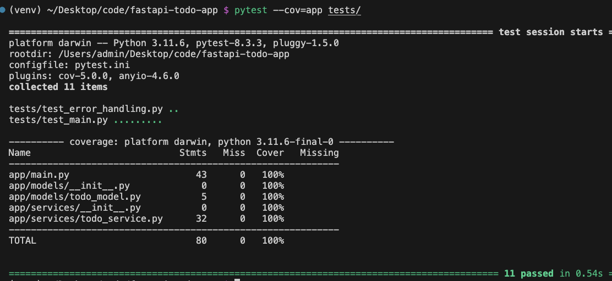

~/Desktop/code/fastapi-todo-app $ python3 -m venv venv                                                                                                                                                                          ──(土,1012)─┘

~/Desktop/code/fastapi-todo-app $ source venv/bin/activate  # Linux/Mac                                                                                                                                                         ──(土,1012)─┘

pytest --cov=app tests/

